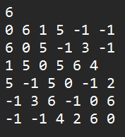
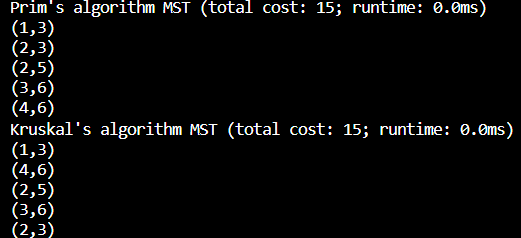

# Minimum Spanning Tree (MST) Algorithms

This repository contains Python code to find the Minimum Spanning Tree (MST) of a given graph using both Prim's and Kruskal's algorithms. The code reads the input graph from a file and outputs the MST with the total cost.


## Table of Contents

- [Usage](#usage)
- [Component Overview](#component-overview)
- [Input Format](#input-format)
- [Algorithms](#algorithms)
- [How to Run](#how-to-run)
- [Example Input](#example-input)
- [Output](#output)


## Usage

You can use this code to find the MST of a graph represented in a specific input file format. The provided code supports both Prim's and Kruskal's algorithms. Here's how to use it:


## Component Overview

- 'Graph Class (prim_mst.py and kruskal_mst.py)': An implementation of a graph using an edge list representation.Utility functions to add edges to the graph and calculate the total weight of the graph.
- 'Prim's Algorithm (prim_mst.py)': An implementation of Prim's algorithm to find the Minimum Spanning Tree. 
Utilizes a priority queue to efficiently select edges with the minimum weight.
Outputs the MST with the total cost.
- 'Kruskal's Algorithm (kruskal_mst.py)': An implementation of Kruskal's algorithm to find the Minimum Spanning Tree.
Utilizes a disjoint-set (MFSET) data structure to detect and avoid cycles.
Outputs the MST with the total cost.
- 'Priority Queue (prim_mst.py and kruskal_mst.py)': A custom implementation of a priority queue using a linked list.
- 'Disjoint Set (MFSET) (kruskal_mst.py)': A faster implementation of the disjoint-set (also known as MFSET) data structure with path compression and union by rank.


## Input Format

The input file should follow this format:

- `n` is the number of vertices in the graph.
- `aij` represents the weight of the edge between vertex `i` and vertex `j`.
- If there's no direct edge between two vertices, the weight should be 0.


## Algorithms

This repository supports two MST algorithms:

- **Prim's Algorithm**: It finds the MST by starting from an arbitrary vertex and repeatedly adding the edge with the minimum weight that connects a vertex in the MST with a vertex outside the MST.

- **Kruskal's Algorithm**: It finds the MST by sorting all the edges in ascending order of their weights and adding them to the MST if they don't create a cycle.


## How to Run

To find the MST of a graph, follow these steps:

1. Create an input file in the specified format.
2. Choose the algorithm you want to use (Prim's or Kruskal's).
3. Run the corresponding Python script:

   - For Prim's Algorithm:
     ```
     python prim_mst.py
     ```

   - For Kruskal's Algorithm:
     ```
     python kruskal_mst.py
     ```

4. Review the output to see the MST and its total cost.

## Example Input

Here's an example input file for a graph with 4 vertices and their edge weights:
-


## Output

The code will generate the MST and display the following:

- Total cost of the MST.
- Edges of the MST.



## Contact Information

Please [contact me](mailto:luckyharrysingh@gmail.com) if you have any queries or comments.
